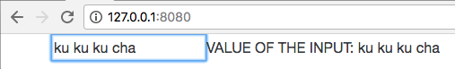
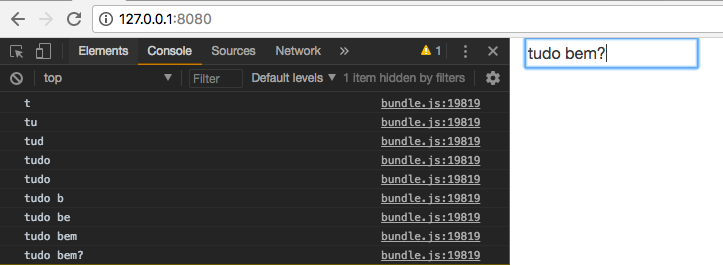

# ReduxSimpleStarter
The origins of this repo are in Stephen Grider's [Udemy course](https://www.udemy.com/react-redux/) on React and Redux.

It has begun as a clone of [this repo](https://github.com/StephenGrider/ReduxSimpleStarter) and will evolve as I continue reviewing the course.

Checkout that repo, install dependencies, then start the `gulp` process with the following:

    > git clone https://github.com/StephenGrider/ReduxSimpleStarter.git
    > cd ReduxSimpleStarter
    > npm install
    > npm start

I'm relying on Stephen Grider's tutorial as I revisit React in 2018. The commits I make to this repo are meant to document my learning and review process. The motivation for this repo is similar to the motivation for [this Django repo](https://github.com/eirinikos/django-tutorial-mysite); that is, I want to write a handy study journal (a log) that my future self can read when she revisits this moment in time.

# React, ES6, and JSX
React is a JS library that produces HTML, and React code is written in the form of individual **components** (i.e., views). The legibility of React code depends largely on the usage of JSX, which allows us to write JS functions that incorporate HTML syntax. (When referencing JS variables within JSX, though, make sure to surround the variables with curly braces, e.g., `{this.state.term}`.)

Our app incorporates ES6 conventions, although neither JSX nor ES6 are currently interpretable by the browser. We make it browser-ready thanks to **webpack, babel, and `bundle.js`**.

`/index.html` has a script tag that references `bundle.js`, which represents the sum of all of the JS in the app. [webpack](https://en.wikipedia.org/wiki/Webpack) and [babel](https://babeljs.io/) are the libraries responsible for compiling All The JS into `bundle.js`. It's not yet clear to me *exactly* how webpack and babel work with each other and *exactly* where `bundle.js` lives, but the [webpack config file](https://github.com/eirinikos/ReduxSimpleStarter/blob/master/webpack.config.js) seems to lend clues.

We rely on babel to transpile our ES6 to vanilla JS (i.e., browser-readable ES5). Try playing around in babel's [in-browser REPL](https://babeljs.io/) to see just how illegible React code can become (if written in plain ES5 script).

## ES6 class-based components
Unlike a functional component, a class-based component has an "intelligent" awareness of itself and its own **state**, i.e., what has happened to itself once it's been rendered in the DOM. Class-based components are capable of **introspection**. It's sufficient to use functional components (or, "dumb" components) when we only need to render JSX and don't need a component to maintain an internal record of its state. 

A class-based React component is also an ES6 class, replete with properties and methods. Note that every React class must include a render function that returns JSX. 

### State
The tutorial introduces the concept of **state** in Sections 1.17 and 1.18. **State** is a plain JS object that's used to record and react to user events. Functional components don't have state (because they're dumb), but class-based components do.

Whenever a class-based component's state changes, the component re-renders. A component's state change triggers all children components to re-render, as well.

In order to initialize a component's state, be sure to declare a class constructor method, e.g.,

    class SearchBar extends Component {
      constructor(props) {
        super(props);

        this.state = {
          property1: 'value1'
          property2: 'value2'
          property3: 'value3'
        };
      }

**In order to update a component's state, be sure to use `this.setState()`**, e.g.,

    render() {
      return <input onChange={event => this.setState({ property1: 'newvalue1' })} />;
    }

(**Do not attempt to update state with something like: `this.state.property1 = ...`**)

----

In Section 1.18, we can see the state-change and component-rerender cycle at work with:

    render() {
      return (
        

          <input onChange={event => this.setState({ term: event.target.value })} />
          VALUE OF THE INPUT: {this.state.term}
        

      );
    }

Whenever a user modifies input in the search bar, state gets updated with `this.setState()`, which then triggers the render function to run anew. State is then retrieved again with `this.state.term` and rendered on the page, alongside `VALUE OF THE INPUT`.

*State change and re-rendering at work in the browser*

----

### Event handlers
This is the tutorial's first version of `SearchBar`'s event handler (as seen in Section 1.16):

    class SearchBar extends Component {
      render() {
        return <input onChange={this.handleInputChange} />; 
      }
    
      handleInputChange(event) {
        console.log(event.target.value);
      }
    }

In the render function's return statement, we are passing a property-value pair to the `input` element in the form of `onChange={this.handleInputChange}`.
(Note that `onChange` is a recognized, protected React-defined property.)

Since our `handleInputChange()` function contains only a `console.log()` statement, we can simplify our code by passing the event handling directly to `onChange`. Here's some ES6 syntactic sugar at work:

    class SearchBar extends Component {
      render() {
        return <input onChange={(event) => console.log(event.target.value)} />; 
      }
    }

And since our event handler takes only one argument, we can simplify further by removing the parentheses around `event`:

    class SearchBar extends Component {
      render() {
        return <input onChange={event => console.log(event.target.value)} />; 
      }
    }

*Console-logging searchbar input upon change event*

----

# YouTube Data API
The first app I'm making is a video app that makes use of the YouTube Data API. It will have a search bar input at the top of the page, above a section that includes the video player and details for the currently-playing video (title and description).

On the right side of the page, there'll be a list of video preview items. This list will be populated according to the search results returned by the API in response to the search request sent via the search bar input.

To access Google APIs, go [here](https://console.developers.google.com).

You can find the YouTube Data API by searching in Google's API library. Be sure to enable the API, create API credentials, and add the API key to `index.js`.

Then, install the `youtube-api-search` package with `npm install --save youtube-api-search`. (`--save` adds the package to our `package.json` file).

